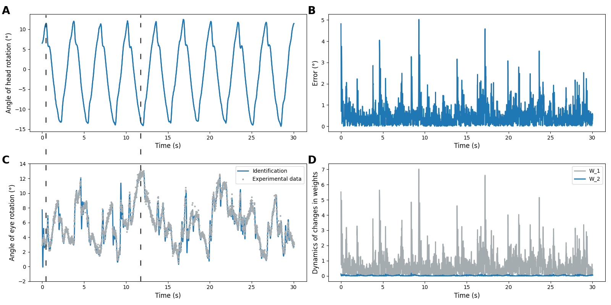

# spikennet

This repo include implementation of spiking differential neural network (SDNN) and examples of learning SDNN on 3 experimental datasets (`winter`, `flights`, `optokinetics`). All datasets contain records of the angles of rotation of the eye and head which describe the vestibulo-ocular reflex (VOR). 

<p align="center">

</p>

## Basic usage

Download repo and setting up a virtual environment: 

```terminal
git clone https://github.com/cut4cut/spikennet.git
cd spikennet
. venv/bin/acivate
pip install -r requirements.txt
```

Fast start testing SDNN via console app. This command learn SDDN with sigmoidal activation function on dataset of flight's experimental data:

```terminal
python main.py -a sigmoidal -d flights
```

After runing this commnd you can see report of model's learning. Also you can use `-h` to show all comands.

```terminal
python main.py -h
```


